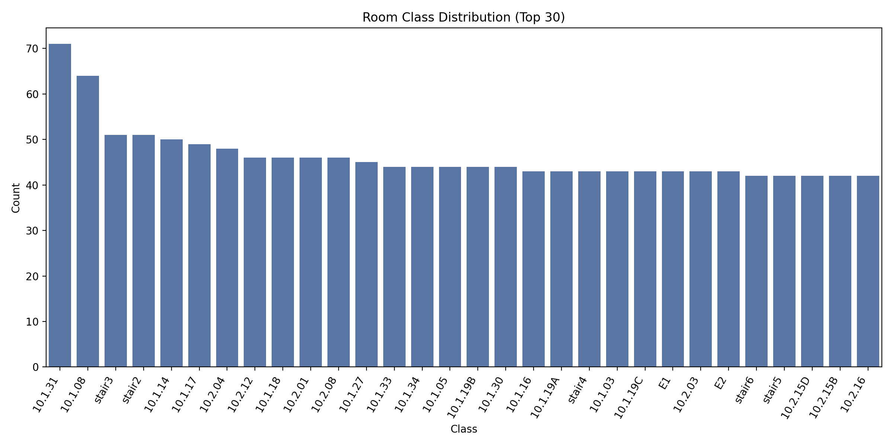
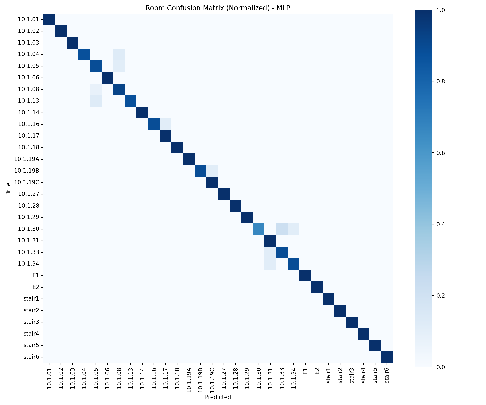
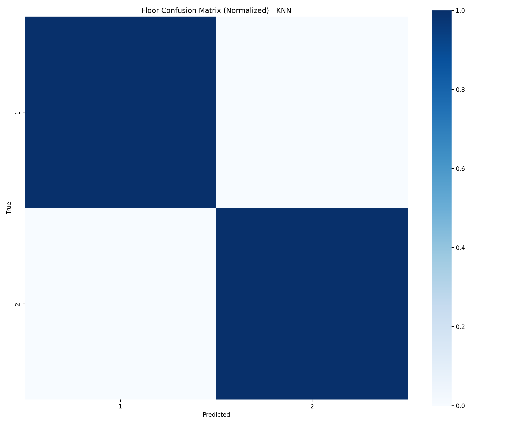

# Building 10 Evaluation Report

## Dataset Summary

- Samples: 1366
- AP features: 143
- Room classes: 30
- Floor classes: 2

## Room Classification (Cross-Validation)

| Model | Accuracy (mean+/-std) | Macro F1 (mean+/-std) |
|---|---|---|
| KNN | 0.9502 +/- 0.0089 | 0.9499 +/- 0.0088 |
| MLP | 0.9583 +/- 0.0076 | 0.9593 +/- 0.0077 |

## Holdout Results

### Room Classification

| Model | Accuracy | Macro Precision | Macro Recall | Macro F1 |
|---|---|---|---|---|
| KNN | 0.9453 | 0.9532 | 0.9455 | 0.9464 |
| MLP | 0.9599 | 0.9677 | 0.9595 | 0.9615 |

### Floor Classification (KNN)

| Accuracy | Macro Precision | Macro Recall | Macro F1 |
|---|---|---|---|
| 1.0000 | 1.0000 | 1.0000 | 1.0000 |

## Visualizations

Room class distribution:

Room confusion matrix (normalized):

Floor confusion matrix (normalized):

