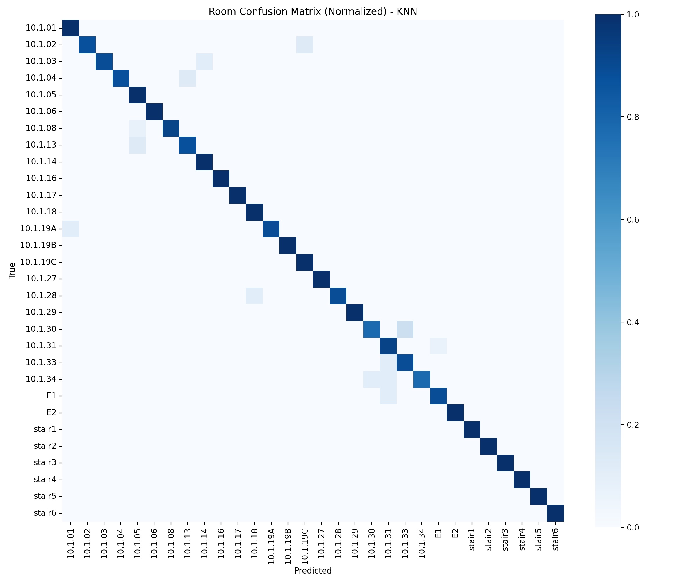
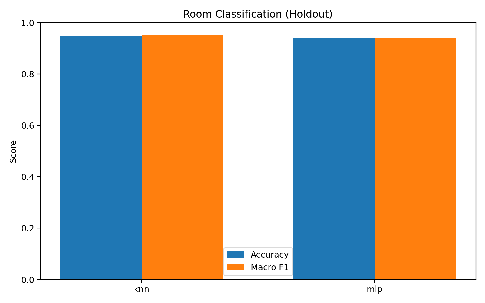

# Building 10 Evaluation Report

## Dataset Summary

- Samples: 1366
- WAP features: 143
- Rooms: 30
- Floors: 2

## Room Classification (Cross-Validation)

| Model | Accuracy (mean+/-std) | Macro F1 (mean+/-std) |
|---|---|---|
| KNN | 0.9385 +/- 0.0176 | 0.9380 +/- 0.0189 |
| MLP | 0.9568 +/- 0.0107 | 0.9569 +/- 0.0110 |

## Holdout Results

### Room Classification

| Model | Accuracy | Macro Precision | Macro Recall | Macro F1 |
|---|---|---|---|---|
| KNN | 0.9489 | 0.9556 | 0.9492 | 0.9503 |
| MLP | 0.9380 | 0.9448 | 0.9380 | 0.9386 |

### Floor Classification (KNN)

| Accuracy | Macro Precision | Macro Recall | Macro F1 |
|---|---|---|---|
| 1.0000 | 1.0000 | 1.0000 | 1.0000 |

## Visualizations

Room class distribution:

Room confusion matrix (normalized):

Floor confusion matrix (normalized):

Room model comparison (holdout):

## Notes

- xgboost not available; xgb model skipped
